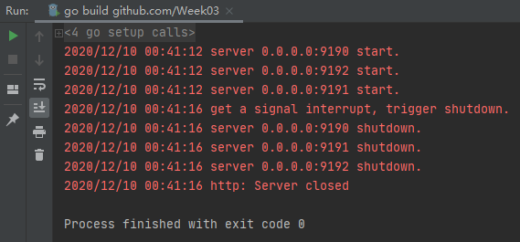

# 作业
基于 errgroup 实现一个 http server 的启动和关闭 ，以及 linux signal 信号的注册和处理，要保证能够 一个退出，全部注销退出。
# 思路
- 利用 errgroup 启动三个http服务 http1、http2 和 http3。
- 当接收到 interrupt 信号时，将三个http服务全部停止。

作业代码： [main.go](https://github.com/qihonggang/Go-000/blob/main/Week03/main.go)。

运行结果：

